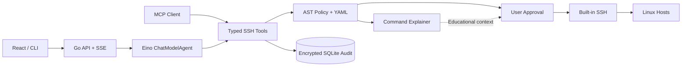

# OpsPilot - AI SSH 运维 Agent

OpsPilot 是一个使用 Go 与 Eino 构建的 AI 运维 Agent。它让 LLM 通过受控工具完成 SSH 诊断、部署和恢复，同时由服务端负责风险判断、人工审批、加密审计和结果脱敏。

## 项目亮点

- 支持多个 OpenAI 兼容模型提供商、独立代理、连接测试和运行时切换。
- 内置跨平台 SSH，支持 `ssh-agent`、上传私钥、密码、网络代理、ProxyJump、sudo 和严格 Host Key 校验。
- 命令由确定性策略分级；变更和高风险操作在执行前由用户审批。
- 会话、工具结果、任务和审批状态持久化，刷新页面不会中断正在运行的 Agent。
- Workspace 支持文件管理、补丁和 Shell；Linux 可使用 Bubblewrap 沙箱，宿主机 Shell 必须逐次审批。
- 内置 Tavily 网络搜索与网页提取，并支持动态加载 Skill 和 MCP 工具。
- 命令、输出和凭据使用 AES-256-GCM 加密保存，模型只接收脱敏后的历史信息。
- React 前端嵌入 Go 二进制，部署时只需要一个可执行文件。



## 快速开始

准备以下环境：

- Git
- Go 1.26+
- Node.js 22+（包含 npm）
- 一个支持 Tool Calling 的 OpenAI 兼容模型

Linux / macOS 的快捷构建命令还需要 `make`。内置 SSH 不依赖系统中的 `ssh` 命令。Bubblewrap 仅用于 Linux 上的 Workspace Shell 沙箱，不影响服务启动和 SSH 功能。

### Linux / macOS

```bash
git clone https://github.com/Enterpr1se0/eino-ops-agent.git
cd eino-ops-agent
cp configs/config.example.yaml configs/config.local.yaml
make build
OPS_AGENT_ADMIN_PASSWORD='use-a-strong-password' \
  ./bin/ops-agent --config configs/config.local.yaml serve
```

### Windows PowerShell

Windows 不需要安装 `make`：

```powershell
git clone https://github.com/Enterpr1se0/eino-ops-agent.git
Set-Location eino-ops-agent
Copy-Item configs/config.example.yaml configs/config.local.yaml
npm --prefix web install
npm --prefix web run build
New-Item -ItemType Directory -Force bin | Out-Null
go build -buildvcs=false -trimpath -ldflags="-s -w" -o bin/ops-agent.exe ./cmd/ops-agent

$env:OPS_AGENT_ADMIN_PASSWORD = 'use-a-strong-password'
.\bin\ops-agent.exe --config configs/config.local.yaml serve
```

构建会把 Web 前端嵌入可执行文件，运行时不需要单独复制 `web/dist`。

### 首次登录

1. 在服务所在电脑打开 [http://127.0.0.1:8080](http://127.0.0.1:8080)；从其他设备访问时将 `127.0.0.1` 换成服务器 IP。
2. 使用 `OPS_AGENT_ADMIN_PASSWORD` 中的密码登录。密码至少需要 12 个字符，并且只在数据库首次初始化时使用。
3. 打开 **配置 → 模型提供商**，添加模型的 Base URL、Model ID 和 API Key。
4. 先点击 **测试**，保存后点击 **使用此模型**。
5. 如需管理远程主机，打开 **配置 → SSH 主机** 添加主机，然后扫描并核对 Host Key 指纹。
6. 回到 **Agent**，新建会话即可开始使用。

数据、加密主密钥、日志和 SQLite 数据库默认写入 `.data/`，Workspace 文件写入 `workspace/`。这两个目录都不会提交到 Git。

### 修改监听地址

默认监听 `0.0.0.0:8080`。可以修改 `configs/config.local.yaml` 中的 `listen_address`，也可以在启动时覆盖：

```bash
OPS_AGENT_LISTEN='127.0.0.1:9090' ./bin/ops-agent --config configs/config.local.yaml serve
```

PowerShell 使用：

```powershell
$env:OPS_AGENT_LISTEN = '127.0.0.1:9090'
.\bin\ops-agent.exe --config configs/config.local.yaml serve
```

`0.0.0.0` 允许其他设备访问，`127.0.0.1` 仅允许本机访问。局域网或公网部署应配置 HTTPS 反向代理，并设置 `OPS_AGENT_SECURE_COOKIES=true`。

### 使用环境变量配置模型

也可以跳过 Web 配置，通过环境变量提供默认模型：

```bash
export OPENAI_API_KEY="your-key"
export OPENAI_BASE_URL="https://your-openai-compatible-endpoint/v1"
export OPENAI_MODEL="your-tool-calling-model"
```

Web 保存的 API Key 使用本机主密钥加密，不会在列表、健康检查或审计中回显。每个模型提供商可以单独配置 HTTP、HTTPS、SOCKS5 或 SOCKS5H 代理。保存或启用提供商后，新请求会立即使用新配置，无需重启服务。

Base URL 可以填写完整 URL，也可以省略协议，例如 `127.0.0.1:11434/v1` 或 `api.example.com/v1`。本机、私网 IP 和单标签主机自动使用 HTTP，公网域名自动使用 HTTPS；误粘贴以 `/models` 或 `/chat/completions` 结尾的完整接口地址也会自动还原为 Base URL。

## 本地开发

```bash
make dev-api
make dev-web
```

在两个终端中分别运行以上命令。Web 开发服务器监听 `0.0.0.0:5173`，访问 [http://127.0.0.1:5173](http://127.0.0.1:5173)，`/api` 请求会自动代理到 `8080` 端口。

## Tavily Web

系统设置中的 Tavily Web 可配置 API 地址、API Key、超时、搜索结果上限、网页提取内容上限和独立网络代理。`web_search` 用于发现来源，`web_extract` 从最多五个指定公开 URL 提取 Markdown；单页默认上限为 32 KiB，单次总量默认上限为 128 KiB。两个 func 可在 Loaded functions 中分别启停。API Key 与代理密码使用 AES-256-GCM 加密保存，只对外返回是否已配置。查询和 URL 会发送给 Tavily，返回内容按不可信外部证据交给模型。审计只保存查询或 URL 列表的 SHA256、耗时、数量和代理使用状态，不保存正文或凭据。

## 会话与上下文

Agent 页面右侧的 Conversations 会列出最近会话，标题取首条用户消息。刷新页面会恢复上次选择的会话并自动定位到最新消息；向上查看旧内容后，新增内容不会强制抢走滚动位置。可以新建、切换或删除历史会话。用户消息、最终 Assistant 回复、模型提供商实际返回的 reasoning 和工具结果卡片都保存在 SQLite；reasoning 卡片默认折叠并只显示最新一行，展开后查看该次模型调用的完整思考过程。不支持 reasoning 的模型不会显示伪造内容。reasoning 仅用于界面历史，不会作为新消息重复发送给模型。跨轮模型上下文按完整用户轮次恢复：脱敏工具结果会作为明确标记的不可信历史证据回放，失败或中断轮次只要已经执行过工具也会保留；较长会话按最近完整轮次和 256 KiB 总预算裁剪。执行真实性仍以审计 Run 为权威记录。命令类 Tool 卡片会直接展示服务端标准化后的完整 program/argv 或完整 Bash 脚本，以及目标主机、工作目录、环境、提权、风险、退出码和分离的 stdout/stderr；原始 JSON 只作为折叠的排错信息。受控操作的审批不会再堆在独立页面中，而是只在发起它的当前会话上方弹出，并同样直接显示 LLM 请求执行的完整命令或脚本。

## Workspace

服务在 `workspace_dir`（默认启动目录下的 `workspace/`）中托管全部 Workspace。首次初始化会创建 `default/read_write`，之后可在系统设置中按名称新增、修改权限或移除；每个 Workspace 固定使用 `<workspace_dir>/<名称>/`，无需填写或查看宿主机绝对路径。移除登记不会删除目录，重新添加同名 Workspace 会复用原有数据。Agent 对话左侧可切换 Workspace、进入子目录、上传不超过 100 MiB 的文件并预览文本。Web 删除会直接永久删除宿主机文件或目录，确认后无法恢复。这些操作不会自动改写提示词或触发 LLM。文本预览上限为 1 MiB，二进制文件只显示元数据和 SHA256。Web 上传使用 CSRF、防路径穿越、敏感文件名拒绝、禁止覆盖、同目录临时文件、`fsync` 和原子落盘。

`workspace_shell` 用于解压、构建、测试和打包等通用本地操作。系统设置提供 `Sandbox`、`Host Shell`、`Disabled` 三种明确模式，默认是 Sandbox，设置变化不会让已审批请求切换执行边界。Sandbox 仅支持 Linux，通过 `workspace_sandbox_path`（默认 `bwrap`，也可用 `OPS_AGENT_WORKSPACE_SANDBOX`）启动隔离的 user/mount/PID/network namespace，只挂载只读系统运行目录、独立 `/tmp` 和目标 Workspace，并禁用网络与嵌套 user namespace；缺少 Bubblewrap 或 namespace 权限时直接失败，不会降级执行。Workspace 的 `read_only/read_write` 决定沙箱挂载权限，`.env*`、`.ssh` 和系统隐藏文件等敏感路径会被遮蔽。

Host Shell 直接拥有当前服务账户可用的宿主机文件系统与网络权限：Unix 使用 Bash，Windows 优先使用 PowerShell 7 (`pwsh.exe`) 并回退 Windows PowerShell。它仅允许 `read_write` Workspace，每次调用都必须重新人工批准，不能创建或复用会话级授权。实际后端、Workspace、脚本、相对工作目录、环境与超时全部进入加密审批摘要；审批后修改模式会导致执行失败。Critical 脚本必须逐次审批并填写原因。`Disabled` 会在创建审批前拒绝调用。

Agent 向远端发送 Workspace 文件只使用 `workspace_file_upload`：源相对路径、读取所得 SHA256、目标主机和远端路径进入同一个审批摘要，批准执行前会再次校验源版本。托管根目录仅在服务内部使用，不写入数据库、API、审计或模型上下文。可通过 `workspace_dir` 或 `OPS_AGENT_WORKSPACE_DIR` 修改统一根目录。

配置文件 Tool 会额外展示 before/after SHA256、权限属主、validator、备份和 file operation ID。`ssh_config_apply` 必须携带读取时得到的版本；审批期间文件发生变化会返回可恢复的 `conflict`，而不是覆盖。Tool 的不存在资源、参数错误、超时和远端失败统一返回 `code/message/retryable/next_action`，不会用普通运行错误中断 Eino ToolNode。

## 日志

服务端统一使用标准库 `log/slog`。终端按 `logging.format` 输出，轮转文件始终使用便于检索的 JSONL；Web 的 **Logs** 页面显示当前进程最近的结构化日志，支持级别、组件、关键字筛选和三秒自动刷新。默认采集 `info` 及以上级别；需要排查 HTTP、Agent、Policy、Approval 和 SSH 的详细生命周期时可启用 Debug：

```bash
OPS_AGENT_LOG_LEVEL=debug ./bin/ops-agent serve
tail -f .data/ops-agent.log | jq
```

日志默认保存在 `.data/ops-agent.log`，单文件 20 MiB、保留 3 个备份，可通过配置文件的 `logging` 段或 `OPS_AGENT_LOG_*` 环境变量调整。Web 缓冲区不跨重启，轮转文件会保留。内置日志只记录 ID、状态、耗时、字节数和命令程序名等排错元数据，不记录 HTTP 正文、API Key、SSH/sudo 密码、模型 reasoning 正文、完整参数或 stdout/stderr；敏感字段名还会在 Handler 层再次替换为 `[REDACTED]`。

## 注册第一个主机

OpsPilot 默认不接受未知 host key。先注册、扫描并人工核对指纹：

```bash
./bin/ops-agent host add \
  --name demo \
  --address 192.0.2.10 \
  --port 22 \
  --user ops

./bin/ops-agent host list
./bin/ops-agent host scan-key HOST_ID
./bin/ops-agent host trust HOST_ID SHA256:THE_VERIFIED_FINGERPRINT
./bin/ops-agent host probe HOST_ID
```

主机可选择当前 `ssh-agent`、上传未加密 OpenSSH 格式私钥或账号密码；Windows Agent 使用系统 OpenSSH Agent named pipe。上传私钥限制为 1 MiB，与 SSH、sudo 和代理密码一样使用 AES-256-GCM 加密保存，API 只返回是否已配置，不返回内容或宿主机路径。执行时只在内存中解密和解析，密钥和密码都不会发送给模型。SSH 首段 TCP 连接可使用带可选认证的 SOCKS5、SOCKS5H 或 HTTP CONNECT 代理；ProxyJump 必须引用另一个已注册且已信任 host key 的主机，每一级都会独立认证并校验 host key，最多四级且拒绝环路。两者同时配置时，代理用于连接第一台跳板机。

从双后端版本升级时会执行一次破坏性 SSH schema 迁移：旧主机及其关联的运行、审批、任务和文件操作记录会被删除，同时移除 System OpenSSH、`ssh_config` 别名和自由格式 ProxyJump 字段。聊天记录、模型设置和 Workspace 文件不受影响。

主机可选择三种 sudo 策略：禁用、目标机已配置最小权限 `NOPASSWD`，或由 OpsPilot 托管 sudo 密码。LLM 不调用 `sudo`，只在 `ssh_exec`、`ssh_run_script`、`ssh_file_write` 或 `ssh_file_apply_patch` 中设置 `elevated: true`。服务端再按主机策略生成 `sudo -n` 或 `sudo -S` 调用；所有 `elevated` 请求固定升级为 Critical，必须逐次人工审批并填写原因。

## 风险与审批

| 风险 | 例子 | 默认行为 |
|---|---|---|
| `read_only` | `ps`、`df`、`journalctl`、读取有限日志 | 自动执行 |
| `change` | 写文件、安装依赖、重启服务、部署 | 人工审批 |
| `critical` | `rm`、`dd`、防火墙、磁盘和 SSH 配置 | 默认阻断，需要逐次人工审批 |
| `forbidden` | 读取私钥、关闭审计、获取主密钥 | 永久拒绝 |

审批绑定主机、目录、命令/脚本、参数、环境和文件内容的 SHA-256。审批后任何修改都会使摘要失效。模型只能查询审批状态，不能调用批准接口。

Web 会话审批框提供三个明确选择：仅允许本次、本会话允许完全相同的操作、拒绝并告诉 LLM 改做什么。确定性 Policy 会立即创建审批，命令解释 Agent 随后在后台用结构化卡片补充作用、影响、常见风险、操作提示和回滚建议；结果随 Run 持久化。解释 Agent 没有 Tool，也不拥有审批 API，调用失败不会阻塞审批，更不能修改风险等级或审批要求。

Agent 的原始 Tool 调用会在 Service 层真正暂停；HTTP 运行上下文与浏览器 SSE 连接解耦，因此刷新页面或临时断网不会取消 Agent Loop。页面恢复后通过会话 state 接口同步后台状态和新增历史，在运行结束前禁止同一会话重复发送或删除。批准并执行完成后，真实结果返回同一个 Tool Call，Eino 从原调用位置继续。后台运行设有 30 分钟上限；服务进程重启仍会终止内存中的 Agent Loop，但审批和审计记录继续保留。会话级授权最长保留 8 小时，并且只忽略说明、预期变化和回滚文案的差异；主机、命令、参数、工作目录、环境、文件路径、脚本内容、超时或提权标记有任何变化都会重新审批。Critical 操作始终要求当次人工审批并填写原因，不能使用会话级授权。拒绝时必须填写替代方案，该内容会作为 `operator_instruction` 返回被暂停的 Tool，模型必须在同一次运行中按新方案继续。

部署、修复、迁移和多组件诊断等复杂任务会先调用 `ops_plan_create` 创建 2–8 个可验证步骤。第一步自动进入 `in_progress`，模型只有在提供实际结果后才能通过 `ops_plan_step_update` 完成当前步骤，后端随后自动启动下一步；越级完成会被拒绝，真实阻塞则保留 blocker。计划存储在 SQLite 并由会话 state 返回，Web 在对话顶部持续显示进度、当前步骤和完成证据；刷新、断网或达到 Agent 迭代上限后都可通过 `ops_plan_get` 从原步骤继续。

CLI 审批示例：

```bash
./bin/ops-agent approval list
./bin/ops-agent approval approve APPROVAL_ID --reason "reviewed command and rollback"
```

自定义规则位于 [configs/policy.yaml](configs/policy.yaml)，可以按主机、程序、命令片段和路径配置 `allow`、`approval`、`critical` 或 `deny`。

## MCP 使用

`ops-agent mcp` 使用官方 MCP Go SDK 启动 stdio Server。以支持 MCP 的客户端为例：

```json
{
  "mcpServers": {
    "opspilot": {
      "command": "/absolute/path/to/bin/ops-agent",
      "args": ["--config", "/absolute/path/to/configs/config.local.yaml", "mcp"]
    }
  }
}
```

MCP 与 Eino 复用同一个 Service、Policy 和 Audit Store；不存在权限更宽的旁路。

Web 的 **Extensions / MCP Servers** 还支持反向角色：让 OpsPilot 作为 MCP Client 连接外部工具服务。支持两种标准传输：

- `stdio`：使用 command + 独立 args 数组直接启动子进程，不经过宿主 Shell；可配置绝对工作目录和加密环境变量。
- `streamable_http`：连接绝对 HTTP(S) MCP endpoint，可配置加密 HTTP Header。

保存后的服务器可以 Test、Retry、Enable、Disable、Edit 或永久 Delete。启用时 OpsPilot 连接服务器、分页发现 `tools/list`，再以 `mcp__<server-hash>__<tool>` 名称注入主 Eino Agent；禁用会关闭 MCP Session，旧 Tool 句柄立即失效，并热重建模型函数列表。环境变量和 Header 使用 AES-256-GCM 加密，Web 只显示键名，不回显值。当前仅导入 MCP Tools，不导入 Resources、Prompts 或 Sampling。

外部 MCP Tool 拥有对应 MCP Server 自身的执行权限，不会自动经过 OpsPilot 的 SSH Policy 或人工审批。因此只应启用管理员信任的服务器；这与 OpsPilot 自己作为 MCP Server 时复用受控 SSH Service 的安全语义不同。

主要工具：

- `ssh_host_list` / `ssh_host_inspect`
- `ssh_exec` / `ssh_run_script`（可选 `background: true` 启动后台任务，默认同步执行）
- `ssh_task_get` / `ssh_task_cancel`
- `ssh_file_read` / `ssh_file_search` / `ssh_file_list` / `ssh_file_stat`
- `ssh_file_write` / `ssh_file_apply_patch` / `ssh_config_apply` / `ssh_config_restore`
- `workspace_list` / `workspace_file_list` / `workspace_file_read` / `workspace_file_search` / `workspace_file_apply_patch` / `workspace_file_upload` / `workspace_shell`
- `ssh_history_search` / `ssh_history_get`
- `ops_skill_list` / `ops_skill_get`

## 数据安全

- `.data/master.key` 首次运行生成，权限为 `0600`；生产演示可通过 `OPS_AGENT_MASTER_KEY` 注入 Base64 编码的 32 字节密钥。
- Web 模型提供商的 API Key 同样采用 AES-256-GCM 加密保存，HTTP API 只暴露是否已配置密钥。
- 主机 SSH/sudo 密码采用 AES-256-GCM 加密保存；HTTP 和 LLM 工具只暴露 `has_password`、`has_sudo_password` 能力标记。
- 原始请求和 stdout/stderr 加密保存；数据库只额外保存脱敏视图用于检索和模型上下文。
- HTTP 默认监听 `0.0.0.0:8080` 便于局域网测试。单管理员登录、CSRF 和登录限速已经启用；公网使用仍必须增加 TLS、防火墙和可信反向代理。
- 远程输出被标记为不可信数据，不能改变系统提示词或策略判定。
- 密码认证仍保持非交互、超时和单次提示限制；优先推荐 SSH 证书/密钥与最小化 `sudo -n`，托管密码用于兼容无法立即改造的目标机。

更详细的实现边界见 [架构文档](docs/architecture.md)，可复现演示见 [演示脚本](docs/demo.md)。

## 常用命令

```bash
make test       # Go 单元测试
make test-web   # TypeScript + Vite 构建
make build      # 构建 Web 与单二进制后端
make check      # 测试并构建全部组件

./bin/ops-agent chat
./bin/ops-agent exec --host HOST_ID --program uname --arg -a --reason diagnosis
./bin/ops-agent audit search "systemctl"
./bin/ops-agent audit show RUN_ID
./bin/ops-agent audit show RUN_ID --raw

# 忘记管理员密码时，在服务所在主机执行；命令完成后可清除该环境变量
OPS_AGENT_ADMIN_PASSWORD='a-new-strong-password' ./bin/ops-agent admin reset-password

```

## 当前边界

当前采用单管理员模式，不包含多租户 RBAC、Vault/SSH CA、远程 MCP OAuth 或 Kubernetes 原生 API。长任务与有限输出保存在 SQLite；重启时无法重新附着到旧 SSH 进程的任务会明确标记为 `interrupted`，而不是消失。

## License

MIT
