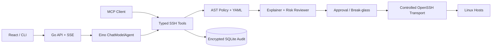

# OpsPilot — Eino AI SSH Control Plane

OpsPilot 是一个使用 Go 与 Eino 构建的 AI 运维 Agent。它把通用 SSH 能力提供给 LLM，同时把安全边界固定在模型之外：每条命令都会经过确定性的风险分析、权限策略、人工审批、加密审计和结果脱敏。

它不是只能部署某一种项目的模板。Agent 可以根据仓库与服务器实际情况，通过通用 SSH 工具完成诊断、部署和恢复；常见流程由 Skill 提高稳定性，但 Skill 不会获得额外权限。

## 项目亮点

- Eino `ChatModelAgent` + 34 个内置强类型 Tools + 动态 MCP Tools，复杂任务会创建持久化步骤计划并严格逐项推进，支持多套 OpenAI-compatible 模型配置、连通测试与运行时热切换。
- 两个隔离、无 Tool 的 Eino SubAgent 并行辅助审批：解释 Agent 面向小白说明影响、风险与回滚；风险 Agent 独立给出证据和控制建议，并且只能维持或上调确定性风险，不能批准或执行。
- SSH、文件、任务与审计查询能力同时暴露为 Eino Function Tools 和官方 MCP Go SDK stdio Server；计划工具只服务于 Agent 会话编排。
- OpenSSH 受控封装，支持 `ssh-agent`、私钥、账号密码、配置别名、ProxyJump、受控 sudo 与严格 host key 校验。
- Bash AST 静态分析、YAML 策略、四级风险、五分钟审批和 Critical 破窗挑战。
- 原始命令与输出 AES-256-GCM 加密；Agent 历史只看到脱敏视图。
- SHA256 版本绑定的事务化配置修改：同目录临时文件、受保护备份、白名单 validator、原子替换、冲突拒绝和失败回滚。
- 启动白名单 Workspace，可安全读、搜、patch 和生成制品；本地修改使用 Go 文件 API，不向模型开放宿主 Shell。
- 单管理员 Cookie/CSRF 认证、SQLite 审计、结构化服务端日志、持久化可取消长任务、历史对话、SSE 与 React 控制台。
- Linux 诊断、任意项目部署、服务恢复三个内置 Skill。
- Web 扩展中心可上传、编辑、永久删除及启停 Skill，也可管理多个 stdio / Streamable HTTP MCP Server；外部工具完成发现后以稳定命名空间热注入 Eino。



## 快速开始

要求：Go 1.26+、Node.js 22+、OpenSSH Client，以及一个支持 Tool Calling 的 OpenAI 兼容模型。

```bash
cp configs/config.example.yaml configs/config.local.yaml
make build
OPS_AGENT_ADMIN_PASSWORD='use-a-strong-password' \
  ./bin/ops-agent --config configs/config.local.yaml serve
```

服务默认监听 `0.0.0.0:8080`。第一次启动必须通过 `OPS_AGENT_ADMIN_PASSWORD` 初始化管理员，明文不会落库；之后可从 System settings 修改密码，或用 `admin reset-password` 从 CLI 恢复。Web 使用 HttpOnly/SameSite Cookie 与 CSRF Token 保护所有敏感 API。局域网测试前仍应配置 HTTPS 反向代理并设置 `OPS_AGENT_SECURE_COOKIES=true`。

也可以用环境变量作为无数据库配置时的兜底：

```bash
export OPENAI_API_KEY="your-key"
export OPENAI_BASE_URL="https://your-openai-compatible-endpoint/v1"
export OPENAI_MODEL="your-tool-calling-model"
```

Web 保存的 API Key 使用本机主密钥加密，列表、健康检查和审计均不会回显密钥。配置表单可调用提供商的 `/models` 自动获取模型列表，并展开下拉框选择 Model ID；编辑已有配置时会在后端复用已加密的 Key。保存前或保存后都可以执行 Test：系统向所选模型发送 `Hello`，收到非空文本即判定正常。修改配置时留空 API Key 会保留原加密值；激活或修改当前配置后，新请求会立即使用新的 Eino Runner，无需重启服务。系统设置还可以把单条消息的 Agent 最大模型迭代数配置为 5–50（默认 20），并分别开关风险评审与小白解释 SubAgent；保存后同样热重载且写入审计。Test 与 SubAgent 评审都会调用提供商并可能产生少量 token 费用。

Base URL 可以填写完整 URL，也可以省略协议，例如 `127.0.0.1:11434/v1` 或 `api.example.com/v1`。本机、私网 IP 和单标签主机自动使用 HTTP，公网域名自动使用 HTTPS；误粘贴以 `/models` 或 `/chat/completions` 结尾的完整接口地址也会自动还原为 Base URL。

本地开发：

```bash
make dev-api
make dev-web
```

Web 开发服务器监听 `0.0.0.0:5173`，本机通过 `http://127.0.0.1:5173` 访问并自动代理 `/api`。

Agent 页面右侧的 Conversations 会列出最近会话，标题取首条用户消息。刷新页面会恢复上次选择的会话并自动定位到最新消息；向上查看旧内容后，新增内容不会强制抢走滚动位置。可以新建、切换或删除历史会话。用户消息、最终 Assistant 回复、模型提供商实际返回的 reasoning 和工具结果卡片都保存在 SQLite；reasoning 卡片默认折叠并只显示最新一行，展开后查看该次模型调用的完整思考过程。不支持 reasoning 的模型不会显示伪造内容。reasoning 仅用于界面历史，不会作为新消息重复发送给模型。工具卡片用于恢复界面，执行真实性仍以审计 Run 为权威记录。命令类 Tool 卡片会直接展示服务端标准化后的完整 program/argv 或完整 Bash 脚本，以及目标主机、工作目录、环境、提权、风险、退出码和分离的 stdout/stderr；原始 JSON 只作为折叠的排错信息。受控操作的审批不会再堆在独立页面中，而是只在发起它的当前会话上方弹出，并同样直接显示 LLM 请求执行的完整命令或脚本。

未显式配置 `workspaces` 时，服务会自动创建启动目录下的 `workspace/`，并以 ID `default`、`read_write` 权限提供给 Workspace Tools；写入仍需版本绑定和人工审批。Agent 对话左侧是独立的 Workspace 文件栏，可进入子目录、上传不超过 100 MiB 的文件、点击文件打开只读预览，或将文件移动到隐藏回收区；这些操作不会自动改写提示词或触发 LLM。文本预览上限为 1 MiB，二进制文件只显示元数据和 SHA256。Web 上传使用 CSRF、防路径穿越、敏感文件名拒绝、禁止覆盖、同目录临时文件、`fsync` 和原子落盘。Agent 向远端发送 Workspace 文件只使用 `workspace_file_upload`：源相对路径、读取所得 SHA256、目标主机和远端绝对路径进入同一个审批摘要，批准执行前会再次校验源版本。发布包也应先由人上传或在远端构建，再从 Workspace 逐主机审批传输。真实根目录不会返回给 LLM。System settings 只展示启动白名单状态。可用 `default_workspace_dir` 或 `OPS_AGENT_DEFAULT_WORKSPACE` 修改位置，设置为空字符串可关闭默认 Workspace。配置一个或多个显式 Workspace 后，自动默认项不会再加入。

配置文件 Tool 会额外展示 before/after SHA256、权限属主、validator、备份和 file operation ID。`ssh_config_apply` 必须携带读取时得到的版本；审批期间文件发生变化会返回可恢复的 `conflict`，而不是覆盖。Tool 的不存在资源、参数错误、超时和远端失败统一返回 `code/message/retryable/next_action`，不会用普通运行错误中断 Eino ToolNode。

服务端统一使用标准库 `log/slog`。终端按 `logging.format` 输出，轮转文件始终使用便于检索的 JSONL；Web 的 **Logs** 页面显示当前进程最近的结构化日志，支持级别、组件、关键字筛选和三秒自动刷新。默认采集 `info` 及以上级别；需要排查 HTTP、Agent、Policy、Approval 和 SSH 的详细生命周期时可启用 Debug：

```bash
OPS_AGENT_LOG_LEVEL=debug ./bin/ops-agent serve
tail -f .data/ops-agent.log | jq
```

日志默认保存在 `.data/ops-agent.log`，单文件 20 MiB、保留 3 个备份，可通过配置文件的 `logging` 段或 `OPS_AGENT_LOG_*` 环境变量调整。Web 缓冲区不跨重启，轮转文件会保留。内置日志只记录 ID、状态、耗时、字节数和命令程序名等排错元数据，不记录 HTTP 正文、API Key、SSH/sudo 密码、模型 reasoning 正文、完整参数或 stdout/stderr；敏感字段名还会在 Handler 层再次替换为 `[REDACTED]`。

## 注册第一个主机

OpsPilot 默认不接受未知 host key。先注册、扫描并人工核对指纹：

```bash
./bin/ops-agent host add \
  --name demo \
  --address 192.0.2.10 \
  --port 22 \
  --user ops

./bin/ops-agent host list
./bin/ops-agent host scan-key HOST_ID
./bin/ops-agent host trust HOST_ID SHA256:THE_VERIFIED_FINGERPRINT
./bin/ops-agent host probe HOST_ID
```

认证优先复用当前 `ssh-agent`。也可以在注册时通过 `--identity` 引用本地私钥文件；私钥内容不会写入数据库或发送给模型。Web 配置中心的 SSH Hosts 页签还支持编辑主机、账号密码认证和四种 OpenSSH 连接配置。SSH 密码使用 AES-256-GCM 保存，执行时通过一次性 `SSH_ASKPASS` FIFO 注入，不进入 argv、环境变量或模型上下文。

主机可选择三种 sudo 策略：禁用、目标机已配置最小权限 `NOPASSWD`，或由控制面托管 sudo 密码。LLM 不调用 `sudo`，只在 `ssh_exec`、`ssh_run_script`、`ssh_file_write` 或 `ssh_file_apply_patch` 中设置 `elevated: true`。服务端再按主机策略生成 `sudo -n` 或 `sudo -S` 调用；所有 `elevated` 请求固定升级为 Critical，必须通过动态 challenge 的 break-glass 审批。

## 风险与审批

| 风险 | 例子 | 默认行为 |
|---|---|---|
| `read_only` | `ps`、`df`、`journalctl`、读取有限日志 | 自动执行 |
| `change` | 写文件、安装依赖、重启服务、部署 | 人工审批 |
| `critical` | `rm`、`dd`、防火墙、磁盘和 SSH 配置 | 默认阻断，需要破窗挑战 |
| `forbidden` | 读取私钥、关闭审计、获取主密钥 | 永久拒绝 |

审批绑定主机、目录、命令/脚本、参数、环境和文件内容的 SHA-256。审批后任何修改都会使摘要失效。模型只能查询审批状态，不能调用批准接口。

Web 会话审批框提供三个明确选择：仅允许本次、本会话允许完全相同的操作、拒绝并告诉 LLM 改做什么。进入审批前，解释与风险 SubAgent 会以相同的标准化请求并行工作，审批框用结构化卡片展示影响、风险、回滚、判断依据、缺失证据、必要控制和置信度；结果随 Run 持久化。SubAgent 没有 Tool，也不拥有审批 API，调用失败时降级回原有确定性 Policy 与人工审批；它返回较低风险会被服务端丢弃，返回更高风险只会升级为 Critical break-glass。

Agent 的原始 Tool 调用会在 Service 层真正暂停；HTTP 运行上下文与浏览器 SSE 连接解耦，因此刷新页面或临时断网不会取消 Agent Loop。页面恢复后通过会话 state 接口同步后台状态和新增历史，在运行结束前禁止同一会话重复发送或删除。批准并执行完成后，真实结果返回同一个 Tool Call，Eino 从原调用位置继续。后台运行设有 30 分钟上限；服务进程重启仍会终止内存中的 Agent Loop，但审批和审计记录继续保留。会话级授权最长保留 8 小时，并且只忽略说明、预期变化和回滚文案的差异；主机、命令、参数、工作目录、环境、文件路径、脚本内容、超时或提权标记有任何变化都会重新审批。Critical 操作始终要求当次 break-glass challenge，不能使用会话级授权。拒绝时必须填写替代方案，该内容会作为 `operator_instruction` 返回被暂停的 Tool，模型必须在同一次运行中按新方案继续。

部署、修复、迁移和多组件诊断等复杂任务会先调用 `ops_plan_create` 创建 2–8 个可验证步骤。第一步自动进入 `in_progress`，模型只有在提供实际结果后才能通过 `ops_plan_step_update` 完成当前步骤，后端随后自动启动下一步；越级完成会被拒绝，真实阻塞则保留 blocker。计划存储在 SQLite 并由会话 state 返回，Web 在对话顶部持续显示进度、当前步骤和完成证据；刷新、断网或达到 Agent 迭代上限后都可通过 `ops_plan_get` 从原步骤继续。

CLI 审批示例：

```bash
./bin/ops-agent approval list
./bin/ops-agent approval approve APPROVAL_ID --reason "reviewed command and rollback"

# Critical 操作还需要页面/列表中显示的动态 challenge
./bin/ops-agent approval approve APPROVAL_ID \
  --challenge "demo-a1b2c3d4" \
  --reason "break-glass: verified snapshot and maintenance window"
```

自定义规则位于 [configs/policy.yaml](configs/policy.yaml)，可以按主机、程序、命令片段和路径配置 `allow`、`approval`、`critical` 或 `deny`。

## MCP 使用

`ops-agent mcp` 使用官方 MCP Go SDK 启动 stdio Server。以支持 MCP 的客户端为例：

```json
{
  "mcpServers": {
    "opspilot": {
      "command": "/absolute/path/to/bin/ops-agent",
      "args": ["--config", "/absolute/path/to/configs/config.local.yaml", "mcp"]
    }
  }
}
```

MCP 与 Eino 复用同一个 Service、Policy 和 Audit Store；不存在权限更宽的旁路。

Web 的 **Extensions / MCP Servers** 还支持反向角色：让 OpsPilot 作为 MCP Client 连接外部工具服务。支持两种标准传输：

- `stdio`：使用 command + 独立 args 数组直接启动子进程，不经过宿主 Shell；可配置绝对工作目录和加密环境变量。
- `streamable_http`：连接绝对 HTTP(S) MCP endpoint，可配置加密 HTTP Header。

保存后的服务器可以 Test、Retry、Enable、Disable、Edit 或永久 Delete。启用时控制面连接服务器、分页发现 `tools/list`，再以 `mcp__<server-hash>__<tool>` 名称注入主 Eino Agent；禁用会关闭 MCP Session，旧 Tool 句柄立即失效，并热重建模型函数列表。环境变量和 Header 使用 AES-256-GCM 加密，Web 只显示键名，不回显值。当前仅导入 MCP Tools，不导入 Resources、Prompts 或 Sampling。

外部 MCP Tool 拥有对应 MCP Server 自身的执行权限，不会自动经过 OpsPilot 的 SSH Policy 或人工审批。因此只应启用管理员信任的服务器；这与 OpsPilot 自己作为 MCP Server 时复用受控 SSH Service 的安全语义不同。

主要工具：

- `ssh_host_list` / `ssh_host_inspect`
- `ssh_exec` / `ssh_run_script`
- `ssh_task_start` / `ssh_task_status` / `ssh_task_tail` / `ssh_task_cancel` / `ssh_task_list`
- `ssh_file_read` / `ssh_file_search` / `ssh_file_list` / `ssh_file_stat`
- `ssh_file_write` / `ssh_file_apply_patch` / `ssh_config_apply` / `ssh_config_restore`
- `workspace_list` / `workspace_file_list` / `workspace_file_read` / `workspace_file_search` / `workspace_file_apply_patch` / `workspace_file_upload`
- `ssh_history_search` / `ssh_history_get`
- `ssh_approval_status`
- `ops_skill_list` / `ops_skill_get`

## 数据安全

- `.data/master.key` 首次运行生成，权限为 `0600`；生产演示可通过 `OPS_AGENT_MASTER_KEY` 注入 Base64 编码的 32 字节密钥。
- Web 模型提供商的 API Key 同样采用 AES-256-GCM 加密保存，HTTP API 只暴露是否已配置密钥。
- 主机 SSH/sudo 密码采用 AES-256-GCM 加密保存；HTTP 和 LLM 工具只暴露 `has_password`、`has_sudo_password` 能力标记。
- 原始请求和 stdout/stderr 加密保存；数据库只额外保存脱敏视图用于检索和模型上下文。
- HTTP 默认监听 `0.0.0.0:8080` 便于局域网测试。单管理员登录、CSRF 和登录限速已经启用；公网使用仍必须增加 TLS、防火墙和可信反向代理。
- 远程输出被标记为不可信数据，不能改变系统提示词或策略判定。
- 密码认证仍保持非交互、超时和单次提示限制；优先推荐 SSH 证书/密钥与最小化 `sudo -n`，托管密码用于兼容无法立即改造的目标机。

更详细的实现边界见 [架构文档](docs/architecture.md)，可复现演示见 [演示脚本](docs/demo.md)。

## 常用命令

```bash
make test       # Go 单元测试
make test-web   # TypeScript + Vite 构建
make build      # 构建 Web 与单二进制后端
make check      # 测试并构建全部组件

./bin/ops-agent chat
./bin/ops-agent exec --host HOST_ID --program uname --arg -a --reason diagnosis
./bin/ops-agent audit search "systemctl"
./bin/ops-agent audit show RUN_ID
./bin/ops-agent audit show RUN_ID --raw

# 忘记管理员密码时，在服务所在主机执行；命令完成后可清除该环境变量
OPS_AGENT_ADMIN_PASSWORD='a-new-strong-password' ./bin/ops-agent admin reset-password

```

## 当前边界

首版是单管理员控制面，不包含多租户 RBAC、Vault/SSH CA、远程 MCP OAuth 或 Kubernetes 原生 API。长任务与有限输出保存在 SQLite；重启时无法重新附着到旧 SSH 进程的任务会明确标记为 `interrupted`，而不是消失。

## License

MIT
